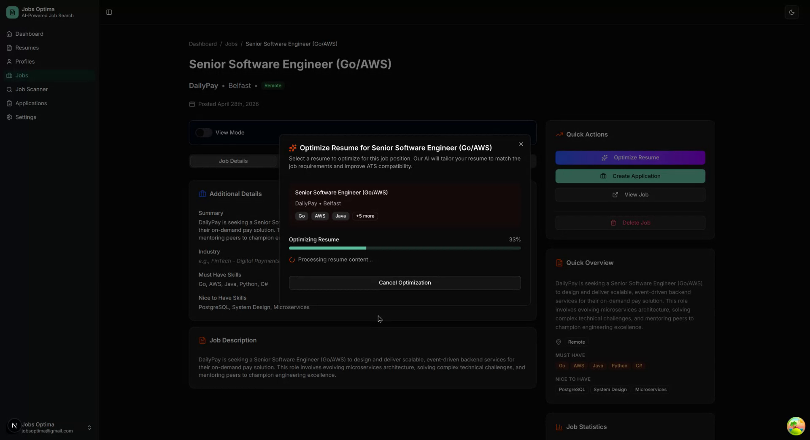

<div align="center">

# Jobs Optima

**The open-source AI resume optimizer. Beat the ATS, land the interview.**

[](LICENSE)
[](https://nextjs.org)
[](https://nestjs.com)
[](https://typescriptlang.org)

[Live Demo](https://jobsoptima.com) · [Documentation](docs/DEPLOYMENT.md) · [Report Bug](https://github.com/l3lackcurtains/resume-builder/issues) · [Request Feature](https://github.com/l3lackcurtains/resume-builder/issues)

</div>

---

Jobs Optima is a self-hostable, AI-powered job search platform that optimizes your resume for ATS systems, tracks applications, scans job boards automatically, and fills applications via a Chrome extension — all in one open-source tool.

## Demo

<p align="center">
  
</p>

<p align="center">
  <video src="docs/assets/jobs-optima-demo.mp4" poster="docs/assets/jobs-optima-screenshot.png" controls playsinline width="80%">
    Your browser does not support the video tag.
  </video>
</p>

## Why Jobs Optima

Most resume tools charge $29–$50/month and lock you into a single workflow. Jobs Optima is free to self-host, works with multiple AI providers, and covers the full job search loop — from optimizing your resume to tracking where you applied.

**What makes it different:**

- **Job Scanner** — automatically scans job boards on a schedule and surfaces matching roles. No other open-source tool does this.
- **Multiple Profiles** — maintain separate professional personas (Frontend, Backend, AI/ML) and apply the right one to each job.
- **ATS Score Tracking** — see your before/after ATS scores for every optimization, not just a generic pass/fail.
- **Bring your own AI key (BYOK)** — each user adds their own Gemini, OpenAI, or Anthropic key in Settings. The platform works with zero server-side AI keys — users are always in control of their own API spend.
- **Optional Pro tier** — operators can enable a Polar-powered subscription that gives subscribers platform-managed Gemini Flash credits (500/month), so non-technical users don't need to sign up for an API provider.
- **Full job search loop** — resume optimization → job tracking → application pipeline → Chrome autofill, all in one place.
- **Self-hostable** — your data stays on your infrastructure. One `docker compose up` and you're running.

## Features

### Resume Optimization
- Upload PDF, DOCX, or TXT — AI extracts and structures your content
- Optimize against any job description with GPT-4 / Claude / Gemini
- Surgical keyword insertion that preserves your original voice
- Side-by-side before/after comparison with ATS score delta
- PDF export of optimized resume and ATS report

### Job Search
- **Job Scanner** — scheduled automatic scanning with configurable filters
- Job tracker with full details, keywords, and match scoring
- Optimize any resume directly from a job posting

### Application Tracking
- Pipeline view: Saved → Applied → Reviewing → Interviewing → Offered → Accepted
- Success rate stats, recent activity feed
- Notes and status history per application

### AI Writing Tools
- Cover letter generator — 5 tailored variations per job
- Interview Q&A prep based on job requirements
- Supports Google Gemini, OpenAI, and Anthropic — provider and model selectable per user
- **BYOK (Bring Your Own Key)** — users add their own API key in Settings; no server-side key required to run the platform

### Account Settings & Billing
- **BYOK mode** — every user can plug in their own Gemini, OpenAI, or Anthropic API key and choose any supported model
- **Optional Pro tier** (Polar) — subscribers get 500 platform-managed Gemini Flash credits per month; no key needed for end users
- Toggle API key visibility, clear the key to revert to Pro credits
- Key-active indicator badge so users always know which key is in use

### Chrome Extension
- Autofill job applications (name, email, phone, location, LinkedIn, GitHub)
- Save jobs from any website in one click
- Opens saved jobs in the web app for optimization

### Profile Management
- Multiple candidate profiles for different job types
- Work authorization, salary preferences, experience level per profile
- Track which profile you used for each application

## Tech Stack

| Layer | Technology |
|---|---|
| Frontend | Next.js 16, React 19, Tailwind CSS, shadcn/ui |
| Backend | NestJS, TypeScript, MongoDB, Redis |
| AI | Google Gemini 2.5 Flash, OpenAI GPT-4, Anthropic Claude |
| Extension | WXT, React, Tailwind CSS |
| Infra | Docker Compose, Caddy (HTTPS), Dokploy-ready |

## Quick Start

### Docker Compose (recommended)

**Prerequisites:** Docker Desktop (or Docker Engine + Compose plugin), MongoDB, and Redis. An AI API key is optional at the server level — users can bring their own via Settings.

> **External services needed before you start:**
> - **MongoDB** — [MongoDB Atlas free tier](https://www.mongodb.com/atlas) (easiest) or a local `mongod` instance
> - **Redis** — [Upstash free tier](https://upstash.com) (easiest) or a local Redis instance
> - **AI API key** (optional server-side) — users add their own key in-app. Or set a server default: [Google AI Studio](https://aistudio.google.com/apikey) (free), [OpenAI](https://platform.openai.com/api-keys), or [Anthropic](https://console.anthropic.com/settings/keys)

#### 1. Clone and configure

```bash
git clone https://github.com/l3lackcurtains/resume-builder.git
cd resume-builder
cp .env.example .env
```

#### 2. Edit `.env`

Open `.env` and fill in the required values:

```env
MONGODB_URI=mongodb+srv://...
REDIS_URL=rediss://...

NEXTAUTH_SECRET=<generate>
JWT_SECRET=<generate>

AI_PROVIDER=gemini
AI_API_KEY=
AI_MODEL=gemini-2.5-flash

NEXTAUTH_URL=http://localhost:4000
CORS_ORIGIN=http://localhost:4000
```

> `INTERNAL_API_URL` is set automatically in `docker-compose.yml` to `http://api:8888/api`
> so Next.js can reach the backend over the internal Docker network — you do not need to set it.

#### 3. Start

```bash
docker compose up -d
```

This builds both images on the first run (takes ~2–3 min). On subsequent starts, cached layers make it near-instant.

| Service | URL |
|---------|-----|
| Web app | http://localhost:4000 |
| API | http://localhost:8888/api |

#### 4. Common commands

```bash
# View logs (follow)
docker compose logs -f

# View logs for a single service
docker compose logs -f api
docker compose logs -f web

# Stop containers (keeps data volumes)
docker compose down

# Stop and remove all data volumes
docker compose down -v

# Restart a single service
docker compose restart api

# Rebuild images after code changes
docker compose build
docker compose up -d

# Rebuild a single service without cache
docker compose build --no-cache api
docker compose up -d api
```

#### 5. Verify it's running

```bash
docker compose ps
```

Both `api` and `web` should show `Up`. If either exits immediately, check logs:

```bash
docker compose logs api
```

Common startup errors and fixes:

| Error | Fix |
|-------|-----|
| `MongoServerError: bad auth` | Check `MONGODB_URI` credentials |
| `Error: connect ECONNREFUSED redis` | Check `REDIS_URL`; use `host.docker.internal` for a local Redis |
| `Platform AI is not configured` | Set `PLATFORM_GEMINI_API_KEY` if you have Pro subscribers; BYOK users are unaffected |
| `Billing is not configured` | Set `POLAR_ACCESS_TOKEN` + `POLAR_PRODUCT_ID`, or leave billing vars blank to disable the Pro tier |
| `port already in use` | Stop your local dev server first (`bun run cleanup:quick`) |

---

### Local Development

**Prerequisites:** Node.js 20.9+, Bun 1.x, MongoDB 6+, Redis

```bash
git clone https://github.com/l3lackcurtains/resume-builder.git
cd resume-builder
bun install

cp .env.example .env
# Fill in values — see .env.example for descriptions

bun run dev
# Web → http://localhost:4000
# API → http://localhost:8888
```

See [`.env.example`](.env.example) for the full variable reference.

## Chrome Extension

```bash
bun run build:extension
```

1. Go to `chrome://extensions/`
2. Enable **Developer mode**
3. Click **Load unpacked** → select `apps/extension/.output/chrome-mv3/`

## Deployment

See [docs/DEPLOYMENT.md](docs/DEPLOYMENT.md) for:
- Docker Compose (local + production with HTTPS)
- Dokploy one-click deploy
- Environment variable reference
- Troubleshooting

## Project Structure

```
resume-builder/
├── apps/
│   ├── web/          Next.js 16 frontend
│   ├── api/          NestJS backend API
│   └── extension/    Chrome extension (WXT)
├── docs/             Deployment and setup guides
├── context/          Architecture and design principles
└── docker-compose.yml
```

## Contributing

Contributions are welcome. See [CONTRIBUTING.md](CONTRIBUTING.md) for how to get started, branch conventions, and what to work on.

## License

MIT — free to use, self-host, and modify.

---

<div align="center">
Built for job seekers, by developers who've been there.
</div>
